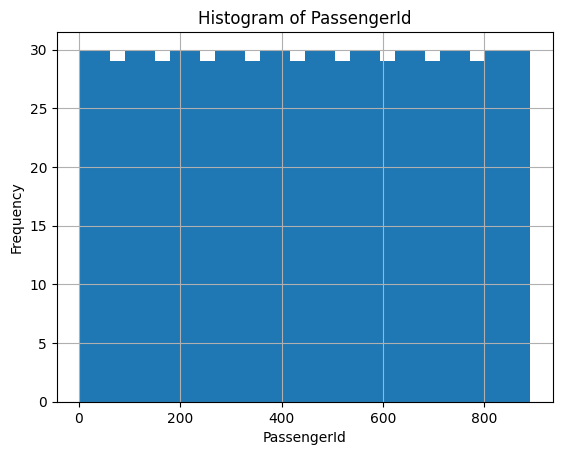
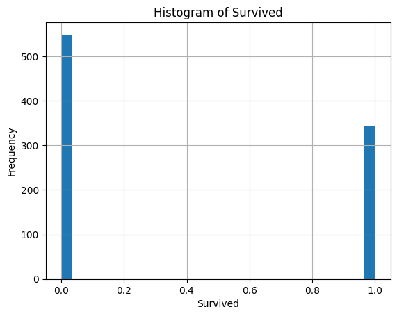
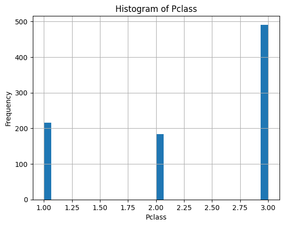
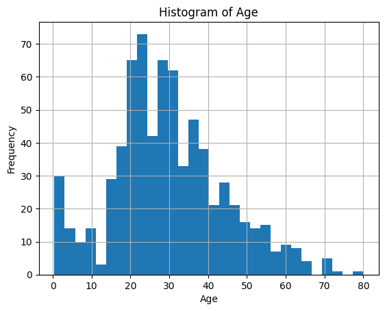
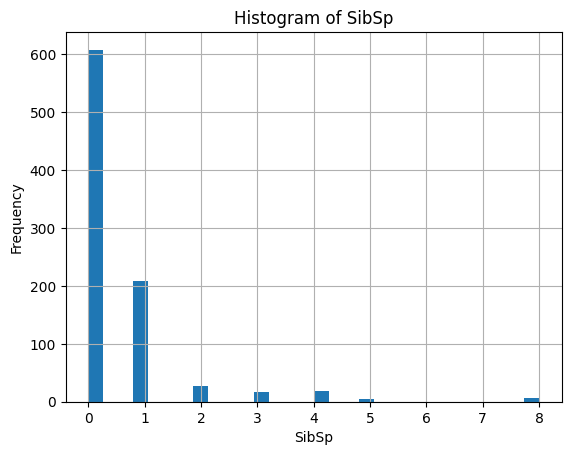
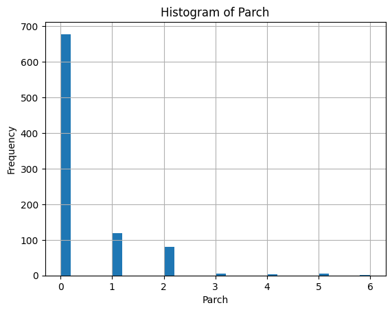
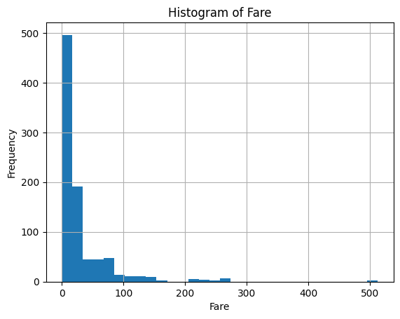

# EDA Report

## Automated Insights (LLM)

Key observations:
1. The dataset contains 891 passengers with 12 columns including demographics, ticket info, and survival status.
2. Age has substantial missingness (~20%), which is critical since age is a key survival predictor.
3. Cabin has very high missingness (~77%), limiting its direct use without imputation or feature engineering.
4. The majority of passengers are male (~65%) and traveled mostly in 3rd class (~55%).
5. Fare distribution is highly skewed with a few very high values, indicating possible outliers or luxury tickets.
6. Embarked has only 2 missing values, mostly from port 'S'.

Data quality issues:
- Missing Age and Cabin values can bias analyses if not handled properly.
- Cabin missingness is so high it may require creating a binary "has_cabin_info" feature instead of imputing.
- Some ticket values repeat multiple times, suggesting group bookings; this might affect independence assumptions.
- Embarked missingness is minimal but should be imputed or removed.

Next steps:
1. Impute missing Age values using median or predictive modeling (e.g., by Pclass, Sex).
2. Create a binary feature for Cabin presence due to high missingness.
3. Explore survival rates by Sex, Pclass, Age groups, and Embarked to identify strong predictors.
4. Investigate ticket groups for family or group survival patterns.
5. Visualize Fare distribution and consider log transformation or outlier treatment before modeling.

**CSV file:** `data\titanic\train.csv`

**Rows:** 891  
**Columns:** 12


## Column dtypes

- `PassengerId`: `int64`
- `Survived`: `int64`
- `Pclass`: `int64`
- `Name`: `str`
- `Sex`: `str`
- `Age`: `float64`
- `SibSp`: `int64`
- `Parch`: `int64`
- `Ticket`: `str`
- `Fare`: `float64`
- `Cabin`: `str`
- `Embarked`: `str`

## Missing values

- `PassengerId`: 0
- `Survived`: 0
- `Pclass`: 0
- `Name`: 0
- `Sex`: 0
- `Age`: 177
- `SibSp`: 0
- `Parch`: 0
- `Ticket`: 0
- `Fare`: 0
- `Cabin`: 687
- `Embarked`: 2

## Numeric summary

```text
       PassengerId    Survived      Pclass         Age       SibSp       Parch        Fare
count   891.000000  891.000000  891.000000  714.000000  891.000000  891.000000  891.000000
mean    446.000000    0.383838    2.308642   29.699118    0.523008    0.381594   32.204208
std     257.353842    0.486592    0.836071   14.526497    1.102743    0.806057   49.693429
min       1.000000    0.000000    1.000000    0.420000    0.000000    0.000000    0.000000
25%     223.500000    0.000000    2.000000   20.125000    0.000000    0.000000    7.910400
50%     446.000000    0.000000    3.000000   28.000000    0.000000    0.000000   14.454200
75%     668.500000    1.000000    3.000000   38.000000    1.000000    0.000000   31.000000
max     891.000000    1.000000    3.000000   80.000000    8.000000    6.000000  512.329200
```

## Categorical summary (top values)

### Name
```text
Name
Braund, Mr. Owen Harris                                1
Cumings, Mrs. John Bradley (Florence Briggs Thayer)    1
Heikkinen, Miss. Laina                                 1
Futrelle, Mrs. Jacques Heath (Lily May Peel)           1
Allen, Mr. William Henry                               1
Moran, Mr. James                                       1
McCarthy, Mr. Timothy J                                1
Palsson, Master. Gosta Leonard                         1
Johnson, Mrs. Oscar W (Elisabeth Vilhelmina Berg)      1
Nasser, Mrs. Nicholas (Adele Achem)                    1
```
### Sex
```text
Sex
male      577
female    314
```
### Ticket
```text
Ticket
347082          7
1601            7
CA. 2343        7
3101295         6
CA 2144         6
347088          6
382652          5
S.O.C. 14879    5
349909          4
347077          4
```
### Cabin
```text
Cabin
NaN            687
G6               4
C23 C25 C27      4
B96 B98          4
F33              3
E101             3
F2               3
D                3
C22 C26          3
C123             2
```
### Embarked
```text
Embarked
S      644
C      168
Q       77
NaN      2
```

## LLM-Suggested Extra Analyses

### Snippet 1
```python
df.corr()
```
**Status:** error
**Error:** `could not convert string to float: 'Braund, Mr. Owen Harris'`

### Snippet 2
```python
df.groupby(['Pclass', 'Sex'])['Survived'].mean()
```
**Status:** success

### Snippet 3
```python
df.boxplot(column='Age', by='Survived', grid=False)
```
**Status:** success


## Plots

### hist_PassengerId


### hist_Survived


### hist_Pclass


### hist_Age


### hist_SibSp


### hist_Parch


### hist_Fare

